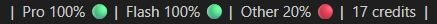

# Antigravity ARN-Lifebar: Minimalist extension to view your AI usage in the Status Bar.

  

 
 

---

  <h2>
    💬 <a href="#fr">🇫🇷 Français</a> | 
    <a href="#en">🇬🇧 English</a> | 
    <a href="#cn">🇨🇳 中文</a> | 
    <a href="#es">🇪🇸 Español</a> | 
    <a href="#ar">🇸🇦 العربية</a> | 
    <a href="#th">🇹🇭 ภาษาไทย</a>
  </h2>

---

 

   
  
  <h2>🇫🇷 Français</h2>
  <h3>
  Vos quotas d'utilisation IA dans la barre inférieure de l'IDE Antigravity : 
  🟢 > 50 % · 🟠 25–50 % · 🔴 ≤ 25 % · ⚫ Pas de donnée.
  </h3>
  

---

### ⛔ Ce que nous n'avons pas

Pourquoi installer un tableau de bord lourd juste pour lire un pourcentage ?

**ARN-Lifebar** va à l'essentiel, **sans bloatware ni télémétrie :** 

* **Zéro Webview :** Tout s'affiche nativement dans votre barre d'état (`Status Bar`).
* **Zéro dépendance :** 100 % JavaScript natif — aucune étape de build. Le code est lisible et auditable.
* **Aucune connexion internet :** Aucune donnée ne sort de votre machine. L'extension détecte le `language_server` de l'IDE Antigravity (100 % Local : `127.0.0.1`).

### ✨ L'essentiel, rien de plus

* **Lecture instantanée :** Vos quotas d'IA en un coup d'œil grâce au code couleur et aux pourcentages.
* **Multiplateforme :** Compatible Windows, macOS et Linux pour Antigravity IDE.
* **Documentation en 6 langues, code propre :** Nous avons traduit ce README pour la communauté ; l'extension elle-même ne contient aucun framework de traduction lourd.

---

## ❓ FAQ & Dépannage

**L'erreur `LS not found` s'affiche, que faire ?**
Antigravity ARN-Lifebar est conçue pour lire les quotas Google AI Plus/Pro/Ultra sur **Antigravity IDE**.  

-> *Utilisez-vous Antigravity IDE ? Et êtes-vous connecté(e) à votre compte Google ?* 
Si oui, alors il s'agit d'un bug : merci d'ouvrir une issue [ici](https://github.com/jzbakh/antigravity-arn-lifebar/issues/new/choose).

---

## 🚀 Installation

<b>🔌 Via l'interface de l'IDE (Recommandé)</b>

 

Fonctionne sur Antigravity IDE, VSCode, Cursor, Windsurf, VSCodium et autres forks (qui utilisent le Microsoft Marketplace ou Open VSX).

1. Ouvrez la vue **Extensions** (`Ctrl+Shift+X`).
2. Recherchez `ARN-Lifebar`.
> 💡 **Astuce :** Filtrez les résultats de recherche par **Nom** (et PAS par popularité, pertinence ou nombre de téléchargements) pour la trouver facilement.
3. Cliquez sur **Installer** et activez l'extension.

<b>💻 Installation via VSIX</b>

 

1. Téléchargez le fichier [`antigravity-arn-lifebar.vsix`](https://github.com/jzbakh/antigravity-arn-lifebar/releases/latest/download/antigravity-arn-lifebar.vsix).
2. Dans Antigravity IDE, ouvrez la vue **Extensions** (`Ctrl+Shift+X`).
3. Cliquez sur le menu "..." (Vues et plus d'actions) en haut de la barre latérale.
4. Sélectionnez **Installer à partir d'un VSIX...**
5. Choisissez le fichier téléchargé et redémarrez l'IDE.

<b>🔧 Installation manuelle</b>

 

1. Créez un dossier nommé `ARN-Lifebar`, puis téléchargez et placez-y les 3 fichiers `package.json`, `extension.js` et `README.md`.
2. Copiez ce dossier dans le répertoire des extensions de votre IDE (exemple pour Antigravity IDE) :
   - **Windows** : `%USERPROFILE%\.antigravity\extensions\`
   - **macOS/Linux** : `~/.antigravity/extensions/`
3. Relancez l'IDE et activez l'extension.

---

## 🩵 Soutenir le projet

 

  <b>💫 Ce projet vous plaît ? Laissez une ⭐ sur GitHub pour soutenir le projet !</b>

  

 

    

---

### ☕ Soutien financier

Si vous souhaitez contribuer financièrement au développement et aux futures mises à jour, vous pouvez m'offrir un café ou faire un don en cryptomonnaies. Merci infiniment ! 🫶

**Dons en cryptomonnaies :**

<b>₿ Bitcoin (BTC)</b>

 

`bc1q4zu08uxpfra9aecp28x6zelg23qdcdeg680hlg`

<b>Ethereum (ETH) & ERC-20 Tokens</b>

 

`0xdc593BfaD6Be146400B713c2787DCCb9392AC206`

<b>Solana (SOL)</b>

 

`FwBu1oqSCdfDvvFhy3crYBkgzjDuwDcU5gxXzVCqxTn9`

---

  <b>Créé avec 🩵 par <a href="https://github.com/jzbakh">jzbakh</a></b>

---

 

   
  
  <h2>🇬🇧 English</h2>
  <h3>
  View your AI usage in the Antigravity IDE Status Bar: 
  🟢 > 50 % · 🟠 25–50 % · 🔴 ≤ 25 % · ⚫ No data.
  </h3>
  

---

### ⛔ What we left out

Why install a heavy dashboard just to read a percentage?

**ARN-Lifebar** gets straight to the point, **with no bloatware or telemetry:** 

* **Zero Webview:** Everything is displayed natively in your `Status Bar`.
* **Zero dependencies:** 100% native JavaScript with no build step, making the code fully readable and auditable.
* **No internet connection:** No data leaves your machine. The extension detects the Antigravity IDE `language_server` (100% Local: `127.0.0.1`).

### ✨ The essentials, nothing more

* **Instant readout:** Your AI quotas at a glance with color coding and percentages.
* **Cross-platform:** Compatible with Windows, macOS, and Linux for Antigravity IDE.
* **Documentation in 6 languages, clean code:** We translated this README for the community; the extension itself contains no heavy translation framework.

---

## ❓ FAQ & Troubleshooting

**I'm getting the `LS not found` error, what should I do?**
Antigravity ARN-Lifebar is designed to read Google AI Plus/Pro/Ultra quotas on **Antigravity IDE**.  

-> *Are you using Antigravity IDE? And are you logged into your Google account?* 
If so, then it is a bug: please open an issue [here](https://github.com/jzbakh/antigravity-arn-lifebar/issues/new/choose).

---

## 🚀 Installation

<b>🔌 Via the IDE interface (Recommended)</b>

 

Works on Antigravity IDE, VSCode, Cursor, Windsurf, VSCodium, and other forks (that use the Microsoft Marketplace or Open VSX).

1. Open the **Extensions** view (`Ctrl+Shift+X`).
2. Search for `ARN-Lifebar`.
> 💡 **Tip:** Filter search results by **Name** (and NOT by popularity, relevance, or download count) to find it easily.
3. Click **Install** and enable the extension.

<b>💻 Installation via VSIX</b>

 

1. Download the [`antigravity-arn-lifebar.vsix`](https://github.com/jzbakh/antigravity-arn-lifebar/releases/latest/download/antigravity-arn-lifebar.vsix) file.
2. In Antigravity IDE, open the **Extensions** view (`Ctrl+Shift+X`).
3. Click the "..." menu (Views and More Actions) at the top of the sidebar.
4. Select **Install from VSIX...**
5. Choose the downloaded file and restart the IDE.

<b>🔧 Manual Installation</b>

 

1. Create a folder named `ARN-Lifebar`, then download and place the 3 files `package.json`, `extension.js`, and `README.md` inside it.
2. Copy this folder into your IDE's extensions directory (example for Antigravity IDE):
   - **Windows**: `%USERPROFILE%\.antigravity\extensions\`
   - **macOS/Linux**: `~/.antigravity/extensions/`
3. Restart the IDE and enable the extension.

---

## 🩵 Support the Project

 

  <b>💫 Do you like this project? Leave a ⭐ on GitHub to support it!</b>

  

 

    

---

### ☕ Financial Support

If you'd like to financially support the development and future updates, you can buy me a coffee or make a cryptocurrency donation. Thank you so much! 🫶

**Cryptocurrency donations:**

<b>₿ Bitcoin (BTC)</b>

 

`bc1q4zu08uxpfra9aecp28x6zelg23qdcdeg680hlg`

<b>Ethereum (ETH) & ERC-20 Tokens</b>

 

`0xdc593BfaD6Be146400B713c2787DCCb9392AC206`

<b>Solana (SOL)</b>

 

`FwBu1oqSCdfDvvFhy3crYBkgzjDuwDcU5gxXzVCqxTn9`

---

  <b>Made with 🩵 by <a href="https://github.com/jzbakh">jzbakh</a></b>

---

 

   
  
  <h2>🇨🇳 中文</h2>
  <h3>
  在 Antigravity IDE 底部状态栏查看您的 AI 使用配额： 
  🟢 > 50 % · 🟠 25–50 % · 🔴 ≤ 25 % · ⚫ 暂无数据。
  </h3>
  

---

### ⛔ What we left out (我们省去的部分)

为什么仅仅为了读取一个百分比就要安装一个笨重的仪表板？

**ARN-Lifebar** 直击本质，**无冗余软件 (Bloatware) 或遥测：** 

* **零 Webview：** 一切都在您的状态栏 (`Status Bar`) 中原生显示。
* **零依赖：** 100% 原生 JavaScript — 无需 build step。代码具有高可读性和可审计性。
* **无互联网连接：** 没有任何数据离开您的机器。扩展程序会检测 Antigravity IDE 的 `language_server`（100% 本地：`127.0.0.1`）。

### ✨ The essentials, nothing more (核心必备，毫无多余)

* **即时读取：** 通过颜色编码和百分比，您的 AI 配额一目了然。
* **跨平台：** 兼容 Windows、macOS 和 Linux（适用于 Antigravity IDE）。
* **6 种语言文档，纯净代码：** 我们为社区翻译了此 README；扩展程序本身不包含任何笨重的翻译框架。

---

## ❓ 常见问题与故障排除

**显示 `LS not found` 错误，该怎么办？**
Antigravity ARN-Lifebar 专为读取 **Antigravity IDE** 上的 Google AI Plus/Pro/Ultra 配额而设计。  

-> *您使用的是 Antigravity IDE 吗？您登录 Google 账号了吗？* 
如果是，那么这是一个 bug：请[在此处](https://github.com/jzbakh/antigravity-arn-lifebar/issues/new/choose)提交 issue。

---

## 🚀 安装

<b>🔌 通过 IDE 界面安装（推荐）</b>

 

支持 Antigravity IDE、VSCode、Cursor、Windsurf、VSCodium 以及其他分支版本（使用 Microsoft Marketplace 或 Open VSX 的版本）。

1. 打开**扩展**视图 (`Ctrl+Shift+X`)。
2. 搜索 `ARN-Lifebar`。
> 💡 **提示：** 按**名称**（而**不是**按受欢迎程度、相关性或下载量）过滤搜索结果，以便轻松找到它。
3. 点击**安装**并启用扩展程序。

<b>💻 通过 VSIX 安装</b>

 

1. 下载 [`antigravity-arn-lifebar.vsix`](https://github.com/jzbakh/antigravity-arn-lifebar/releases/latest/download/antigravity-arn-lifebar.vsix) 文件。
2. 在 Antigravity IDE 中，打开**扩展**视图 (`Ctrl+Shift+X`)。
3. 点击侧边栏顶部的 "..." 菜单（视图和更多操作）。
4. 选择 **从 VSIX 安装...**
5. 选择下载的文件并重启 IDE。

<b>🔧 手动安装</b>

 

1. 创建一个名为 `ARN-Lifebar` 的文件夹，然后下载并将 `package.json`、`extension.js` 和 `README.md` 这 3 个文件放入其中。
2. 将此文件夹复制到您的 IDE 扩展目录中（以 Antigravity IDE 为例）：
   - **Windows**: `%USERPROFILE%\.antigravity\extensions\`
   - **macOS/Linux**: `~/.antigravity/extensions/`
3. 重启 IDE 并启用扩展程序。

---

## 🩵 支持项目

 

  <b>💫 喜欢这个项目吗？在 GitHub 上点亮 ⭐ 来支持我们吧！</b>

  

 

    

---

### ☕ 资金支持

如果您愿意在资金上支持本项目的开发和未来的更新，可以请我喝杯咖啡或进行加密货币捐赠。非常感谢！🫶

**加密货币捐赠：**

<b>₿ 比特币 (Bitcoin)</b>

 

`bc1q4zu08uxpfra9aecp28x6zelg23qdcdeg680hlg`

<b>以太坊 (Ethereum) & ERC-20 代币</b>

 

`0xdc593BfaD6Be146400B713c2787DCCb9392AC206`

<b>索拉纳 (Solana)</b>

 

`FwBu1oqSCdfDvvFhy3crYBkgzjDuwDcU5gxXzVCqxTn9`

---

  <b>由 <a href="https://github.com/jzbakh">jzbakh</a> 用 🩵 制作</b>

---

 

   
  
  <h2>🇪🇸 Español</h2>
  <h3>
  Tus cuotas de uso de IA en la barra inferior del IDE Antigravity: 
  🟢 > 50 % · 🟠 25–50 % · 🔴 ≤ 25 % · ⚫ Sin datos.
  </h3>
  

---

### ⛔ Lo que no incluimos

¿Por qué instalar un panel de control pesado solo para leer un porcentaje?

**ARN-Lifebar** va a lo esencial, **sin bloatware ni telemetría:** 

* **Cero Webview:** Todo se muestra nativamente en tu barra de estado (`Status Bar`).
* **Cero dependencias:** 100% JavaScript nativo — sin build step. El código es legible y auditable.
* **Sin conexión a internet:** Ningún dato sale de tu máquina. La extensión detecta el `language_server` del IDE Antigravity (100% Local: `127.0.0.1`).

### ✨ Lo esencial, nada más

* **Lectura instantánea:** Tus cuotas de IA de un vistazo gracias al código de colores y a los porcentajes.
* **Multiplataforma:** Compatible con Windows, macOS y Linux para Antigravity IDE.
* **Documentación en 6 idiomas, código limpio:** Hemos traducido este README para la comunidad; la extensión en sí no contiene ningún framework de traducción pesado.

---

## ❓ FAQ & Solución de problemas

**Aparece el error `LS not found`, ¿qué hacer?**
Antigravity ARN-Lifebar está diseñada para leer las cuotas de Google AI Plus/Pro/Ultra en **Antigravity IDE**.  

-> *¿Utilizas Antigravity IDE? ¿Y has iniciado sesión en tu cuenta de Google?* 
Si es así, entonces se trata de un bug: por favor, abre un issue [aquí](https://github.com/jzbakh/antigravity-arn-lifebar/issues/new/choose).

---

## 🚀 Instalación

<b>🔌 A través de la interfaz del IDE (Recomendado)</b>

 

Funciona en Antigravity IDE, VSCode, Cursor, Windsurf, VSCodium y otros forks (que utilizan el Microsoft Marketplace o Open VSX).

1. Abre la vista de **Extensiones** (`Ctrl+Shift+X`).
2. Busca `ARN-Lifebar`.
> 💡 **Consejo:** Filtra los resultados de búsqueda por **Nombre** (y NO por popularidad, relevancia o número de descargas) para encontrarla fácilmente.
3. Haz clic en **Instalar** y activa la extensión.

<b>💻 Instalación a través de VSIX</b>

 

1. Descarga el archivo [`antigravity-arn-lifebar.vsix`](https://github.com/jzbakh/antigravity-arn-lifebar/releases/latest/download/antigravity-arn-lifebar.vsix).
2. En Antigravity IDE, abre la vista de **Extensiones** (`Ctrl+Shift+X`).
3. Haz clic en el menú "..." (Vistas y más acciones) en la parte superior de la barra lateral.
4. Selecciona **Instalar desde VSIX...**
5. Elige el archivo descargado y reinicia el IDE.

<b>🔧 Instalación manual</b>

 

1. Crea una carpeta llamada `ARN-Lifebar`, luego descarga y coloca en ella los 3 archivos `package.json`, `extension.js` y `README.md`.
2. Copia esta carpeta en el directorio de extensiones de tu IDE (ejemplo para Antigravity IDE):
   - **Windows**: `%USERPROFILE%\.antigravity\extensions\`
   - **macOS/Linux**: `~/.antigravity/extensions/`
3. Reinicia el IDE y activa la extensión.

---

## 🩵 Apoyar el proyecto

 

  <b>💫 ¿Te gusta este proyecto? ¡Deja una ⭐ en GitHub para apoyar el proyecto!</b>

  

 

    

---

### ☕ Apoyo financiero

Si deseas contribuir económicamente al desarrollo y a futuras actualizaciones, puedes invitarme a un café o hacer una donación en criptomonedas. ¡Muchas gracias! 🫶

**Donaciones en criptomonedas:**

<b>₿ Bitcoin (BTC)</b>

 

`bc1q4zu08uxpfra9aecp28x6zelg23qdcdeg680hlg`

<b>Ethereum (ETH) & ERC-20 Tokens</b>

 

`0xdc593BfaD6Be146400B713c2787DCCb9392AC206`

<b>Solana (SOL)</b>

 

`FwBu1oqSCdfDvvFhy3crYBkgzjDuwDcU5gxXzVCqxTn9`

---

  <b>Hecho con 🩵 por <a href="https://github.com/jzbakh">jzbakh</a></b>

---

 

   
  
  <h2>🇸🇦 العربية</h2>
  <h3>
  حصص استخدام الذكاء الاصطناعي في الشريط السفلي لبيئة التطوير Antigravity IDE: 
  🟢 > 50 % · 🟠 25–50 % · 🔴 ≤ 25 % · ⚫ لا توجد بيانات.
  </h3>
  

---

### ⛔ بدون إضافات غير ضرورية

لماذا تقوم بتثبيت لوحة تحكم ثقيلة فقط لقراءة نسبة مئوية؟

**ARN-Lifebar** تركز على الأهم، **بدون برامج زائدة (bloatware) أو قياس عن بعد (telemetry):** 

* **بدون واجهة ويب (Webview):** يُعرض كل شيء بشكل أصلي في شريط الحالة (`Status Bar`) الخاص بك.
* **بدون تبعيات:** JavaScript أصلي 100% — بدون خطوة بناء (build step). الكود قابل للقراءة والتدقيق.
* **بدون اتصال بالإنترنت:** لا تخرج أي بيانات من جهازك. تكتشف الإضافة الخادم اللغوي (`language_server`) الخاص بـ Antigravity IDE (محلي 100%: `127.0.0.1`).

### ✨ الأساسيات، لا أكثر

* **قراءة فورية:** حصص الذكاء الاصطناعي الخاصة بك في لمحة بفضل الترميز اللوني والنسب المئوية.
* **متعدد المنصات:** متوافق مع Windows و macOS و Linux لبيئة التطوير Antigravity IDE.
* **توثيق بـ 6 لغات، كود نظيف:** قمنا بترجمة ملف README هذا من أجل المجتمع؛ الإضافة نفسها لا تحتوي على أي إطار عمل (framework) ترجمة ثقيل.

---

## ❓ الأسئلة الشائعة واستكشاف الأخطاء وإصلاحها

**يظهر الخطأ `LS not found`، ماذا أفعل؟**
تم تصميم Antigravity ARN-Lifebar لقراءة حصص Google AI Plus/Pro/Ultra على **Antigravity IDE**.  

-> *هل تستخدم Antigravity IDE؟ وهل أنت مسجل الدخول إلى حساب Google الخاص بك؟* 
إذا كان الأمر كذلك، فهذا يعني وجود خلل (bug): يُرجى فتح مشكلة (issue) [هنا](https://github.com/jzbakh/antigravity-arn-lifebar/issues/new/choose).

---

## 🚀 التثبيت

<b>🔌 عبر واجهة بيئة التطوير (موصى به)</b>

 

تعمل الإضافة على Antigravity IDE و VSCode و Cursor و Windsurf و VSCodium والتفرعات الأخرى (التي تستخدم Microsoft Marketplace أو Open VSX).

1. افتح عرض **الإضافات** (`Ctrl+Shift+X`).
2. ابحث عن `ARN-Lifebar`.
> 💡 **تلميح:** قم بتصفية نتائج البحث حسب **الاسم** (وليس حسب الشعبية أو الصلة أو عدد التنزيلات) للعثور عليها بسهولة.
3. انقر على **تثبيت** وقم بتفعيل الإضافة.

<b>💻 التثبيت عبر VSIX</b>

 

1. قم بتنزيل ملف [`antigravity-arn-lifebar.vsix`](https://github.com/jzbakh/antigravity-arn-lifebar/releases/latest/download/antigravity-arn-lifebar.vsix).
2. في Antigravity IDE، افتح عرض **الإضافات** (`Ctrl+Shift+X`).
3. انقر على قائمة "..." (طرق العرض ومزيد من الإجراءات) أعلى الشريط الجانبي.
4. حدد **تثبيت من VSIX...**
5. اختر الملف الذي تم تنزيله وأعد تشغيل بيئة التطوير (IDE).

<b>🔧 التثبيت اليدوي</b>

 

1. أنشئ مجلدًا باسم `ARN-Lifebar`، ثم قم بتنزيل ووضع الملفات الثلاثة `package.json` و `extension.js` و `README.md` بداخله.
2. انسخ هذا المجلد إلى دليل إضافات بيئة التطوير الخاصة بك (مثال لـ Antigravity IDE):
   - **Windows:** `%USERPROFILE%\.antigravity\extensions\`
   - **macOS/Linux:** `~/.antigravity/extensions/`
3. أعد تشغيل بيئة التطوير وقم بتفعيل الإضافة.

---

## 🩵 دعم المشروع

 

  <b>💫 هل يعجبك هذا المشروع؟ اترك ⭐ على GitHub لدعم المشروع!</b>

  

 

    

---

### ☕ الدعم المالي

إذا كنت ترغب في المساهمة ماليًا في التطوير والتحديثات المستقبلية، يمكنك أن تشتري لي قهوة أو تتبرع بالعملات المشفرة. شكرًا جزيلاً لك! 🫶

**التبرعات بالعملات المشفرة:**

<b>₿ بيتكوين (Bitcoin)</b>

 

`bc1q4zu08uxpfra9aecp28x6zelg23qdcdeg680hlg`

<b>إيثريوم (Ethereum) ورموز ERC-20</b>

 

`0xdc593BfaD6Be146400B713c2787DCCb9392AC206`

<b>سولانا (Solana)</b>

 

`FwBu1oqSCdfDvvFhy3crYBkgzjDuwDcU5gxXzVCqxTn9`

---

  <b>صُنع بـ 🩵 بواسطة <a href="https://github.com/jzbakh">jzbakh</a></b>

---

 

   
  
  <h2>🇹🇭 ภาษาไทย</h2>
  <h3>
  โควตาการใช้งาน AI ของคุณในแถบด้านล่างของ Antigravity IDE: 
  🟢 > 50 % · 🟠 25–50 % · 🔴 ≤ 25 % · ⚫ ไม่มีข้อมูล
  </h3>
  

---

### ⛔ สิ่งที่คุณจะไม่เจอ

ทำไมต้องติดตั้งแดชบอร์ดที่หนักหน่วงเพียงเพื่ออ่านค่าเปอร์เซ็นต์?

**ARN-Lifebar** มุ่งเน้นไปที่สิ่งสำคัญ **ปราศจากซอฟต์แวร์ขยะ (bloatware) และการเก็บข้อมูลทางไกล (telemetry):** 

* **ไม่มีเว็บวิว (Webview):** ทุกอย่างจะถูกแสดงผลแบบเนทีฟในแถบสถานะ (`Status Bar`) ของคุณ
* **ไม่มี Dependency:** เป็น JavaScript แบบเนทีฟ 100% — ไม่มีขั้นตอนการสร้าง (build step) โค้ดสามารถอ่านและตรวจสอบได้
* **ไม่ต้องเชื่อมต่ออินเทอร์เน็ต:** ไม่มีข้อมูลใดออกจากเครื่องของคุณ ส่วนขยายจะตรวจจับเซิร์ฟเวอร์ภาษา (`language_server`) ของ Antigravity IDE (ทำงานในเครื่อง 100%: `127.0.0.1`)

### ✨ สิ่งสำคัญเท่านั้น ไม่มีส่วนเกิน

* **อ่านค่าได้ทันที:** โควตา AI ของคุณในพริบตาด้วยรหัสสีและเปอร์เซ็นต์
* **รองรับหลายแพลตฟอร์ม:** รองรับ Windows, macOS และ Linux สำหรับ Antigravity IDE
* **เอกสารประกอบ 6 ภาษา, โค้ดสะอาด:** เราได้แปลไฟล์ README นี้สำหรับชุมชน ส่วนขยายนี้ไม่มีเฟรมเวิร์ก (framework) การแปลภาษาที่หนักหน่วง

---

## ❓ คำถามที่พบบ่อยและการแก้ไขปัญหา

**หากพบข้อผิดพลาด `LS not found` ควรทำอย่างไร?**
Antigravity ARN-Lifebar ได้รับการออกแบบมาเพื่ออ่านโควตา Google AI Plus/Pro/Ultra บน **Antigravity IDE** 

-> *คุณกำลังใช้ Antigravity IDE อยู่หรือไม่? และคุณได้เข้าสู่ระบบบัญชี Google ของคุณแล้วหรือยัง?* 
หากใช่ แสดงว่าเป็นข้อผิดพลาด (bug): โปรดเปิดปัญหา (issue) [ที่นี่](https://github.com/jzbakh/antigravity-arn-lifebar/issues/new/choose)

---

## 🚀 การติดตั้ง

<b>🔌 ผ่านอินเทอร์เฟซของ IDE (แนะนำ)</b>

 

ทำงานบน Antigravity IDE, VSCode, Cursor, Windsurf, VSCodium และรุ่นดัดแปลงอื่น ๆ (ที่ใช้ Microsoft Marketplace หรือ Open VSX)

1. เปิดมุมมอง **ส่วนขยาย (Extensions)** (`Ctrl+Shift+X`)
2. ค้นหา `ARN-Lifebar`
> 💡 **เคล็ดลับ:** กรองผลการค้นหาด้วย **ชื่อ** (ไม่ใช่ตามความนิยม ความเกี่ยวข้อง หรือจำนวนการดาวน์โหลด) เพื่อให้ค้นพบได้ง่าย
3. คลิก **ติดตั้ง (Install)** และเปิดใช้งานส่วนขยาย

<b>💻 การติดตั้งผ่าน VSIX</b>

 

1. ดาวน์โหลดไฟล์ [`antigravity-arn-lifebar.vsix`](https://github.com/jzbakh/antigravity-arn-lifebar/releases/latest/download/antigravity-arn-lifebar.vsix)
2. ใน Antigravity IDE ให้เปิดมุมมอง **ส่วนขยาย (Extensions)** (`Ctrl+Shift+X`)
3. คลิกที่เมนู "..." (มุมมองและการดำเนินการเพิ่มเติม) ที่ด้านบนสุดของแถบด้านข้าง
4. เลือก **ติดตั้งจาก VSIX... (Install from VSIX...)**
5. เลือกไฟล์ที่ดาวน์โหลดมาแล้วรีสตาร์ท IDE

<b>🔧 การติดตั้งด้วยตนเอง</b>

 

1. สร้างโฟลเดอร์ชื่อ `ARN-Lifebar` จากนั้นดาวน์โหลดและวางไฟล์ 3 ไฟล์ ได้แก่ `package.json`, `extension.js` และ `README.md` ไว้ข้างใน
2. คัดลอกโฟลเดอร์นี้ไปยังไดเรกทอรีส่วนขยายของ IDE ของคุณ (ตัวอย่างสำหรับ Antigravity IDE):
   - **Windows:** `%USERPROFILE%\.antigravity\extensions\`
   - **macOS/Linux:** `~/.antigravity/extensions/`
3. รีสตาร์ท IDE และเปิดใช้งานส่วนขยาย

---

## 🩵 สนับสนุนโครงการ

 

  <b>💫 คุณชอบโครงการนี้ไหม? กดให้ ⭐ บน GitHub เพื่อสนับสนุนโครงการ!</b>

  

 

    

---

### ☕ การสนับสนุนทางการเงิน

หากคุณต้องการสนับสนุนทางการเงินสำหรับการพัฒนาและการอัปเดตในอนาคต คุณสามารถเลี้ยงกาแฟฉันหรือบริจาคเป็นสกุลเงินดิจิทัลได้ ขอบคุณมาก! 🫶

**การบริจาคสกุลเงินดิจิทัล:**

<b>₿ บิตคอยน์ (Bitcoin)</b>

 

`bc1q4zu08uxpfra9aecp28x6zelg23qdcdeg680hlg`

<b>อีเธอร์เรียม (Ethereum) และโทเค็น ERC-20</b>

 

`0xdc593BfaD6Be146400B713c2787DCCb9392AC206`

<b>โซลานา (Solana)</b>

 

`FwBu1oqSCdfDvvFhy3crYBkgzjDuwDcU5gxXzVCqxTn9`

---

  <b>สร้างด้วย 🩵 โดย <a href="https://github.com/jzbakh">jzbakh</a></b>

